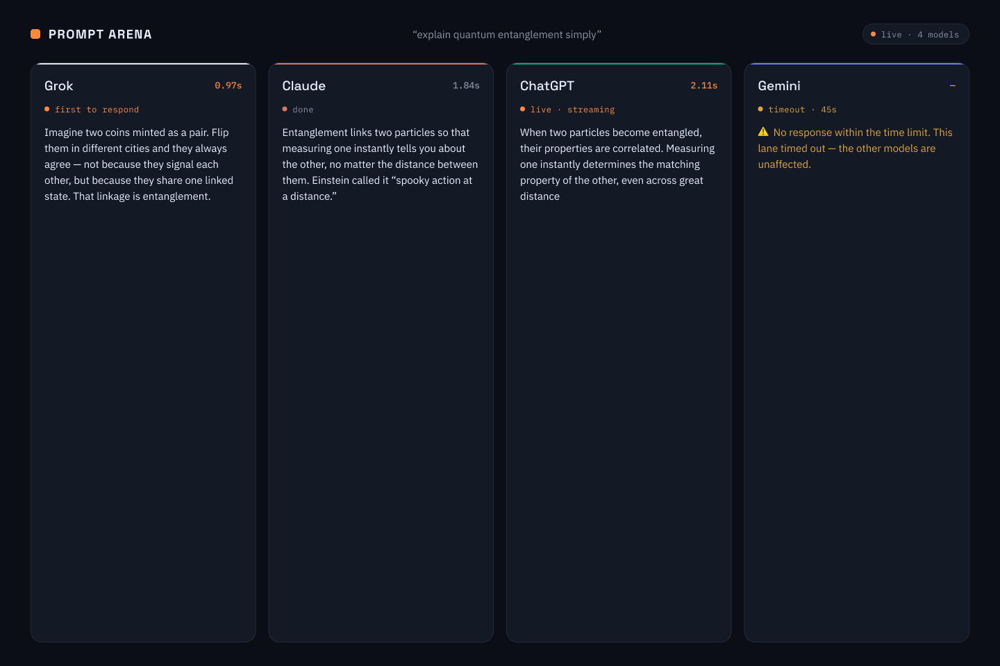
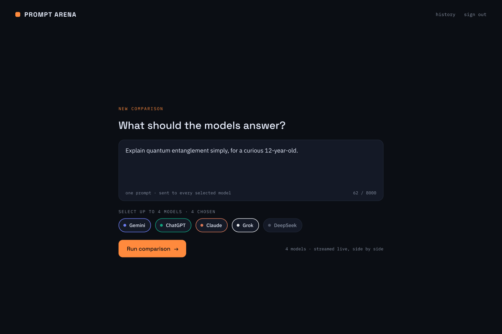
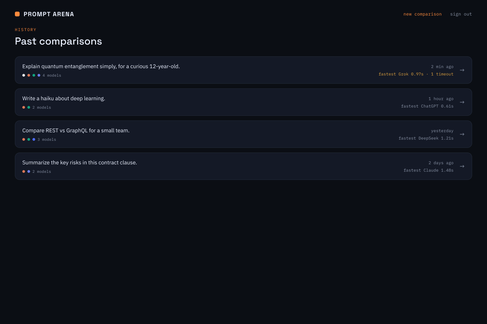
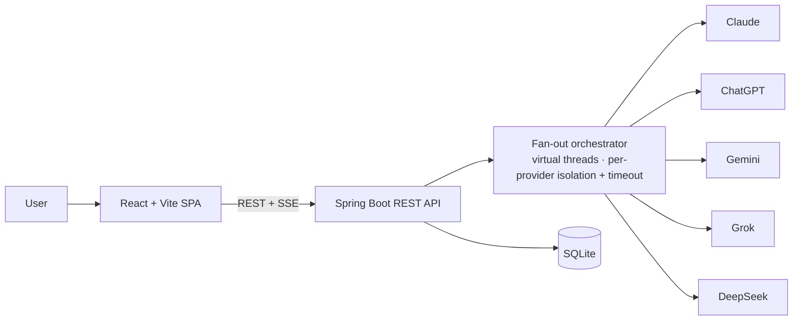

<div align="center">

# 🪐 Prompt Arena

### Parallel, side-by-side evaluation of generative AI

*One prompt, many models, one screen — compare the answers and see the biases.*

[](https://github.com/dylandmr/tcc-engsoft-unicesumar-dylan-rodrigues-52-2026/actions/workflows/ci.yml)


</div>

---

> **Sobre (PT-BR).** *Prompt Arena* é uma plataforma web para avaliação **paralela e comparativa** de
> inteligências artificiais generativas. Uma mesma consulta é disparada simultaneamente a múltiplos
> provedores (Gemini, ChatGPT, Claude, Grok, DeepSeek) e as respostas são exibidas lado a lado, para
> que o usuário identifique vieses e diferenças de qualidade. Protótipo de Trabalho de Conclusão de
> Curso (Engenharia de Software — UNICESUMAR), desenvolvido com **programação agêntica** e
> **Desenvolvimento Orientado a Especificações (Spec-Driven Development)**.

## What it does

A signed-in user writes **one prompt**, picks up to **four** AI models, and hits run. Each model gets
the same prompt, runs **concurrently in its own lane**, and streams its answer back **live** — so you
can read them side by side and judge accuracy, tone, and bias for yourself. If one model is slow,
errors, or times out, its lane shows that state **without affecting the others**.

### The Arena

<div align="center">



*Each provider runs in its own brand-hued lane with live latency telemetry. Here Grok answered first,
Claude & ChatGPT are done/streaming, and Gemini timed out — isolated, while the rest render.*

</div>

| Compose | History |
|---|---|
|  |  |

<sub>Mockups for the "Observation Deck" design direction — see [`design/`](design/) and the [Figma file](https://www.figma.com/design/CjHEyeFxsEigAQvcDcQWGr).</sub>

## Features

- 🆚 **Parallel comparison** — one prompt fanned out to up to 4 of 5 providers (Gemini, ChatGPT, Claude, Grok, DeepSeek), concurrently.
- 🛡️ **Isolated failures** — a slow/failing/timed-out provider surfaces in its own lane only; the others are never blocked.
- ⏱️ **Live telemetry** — responses stream in as they arrive (Server-Sent Events) with per-model latency.
- 🔐 **Per-user accounts** — minimal username/password session auth; data is scoped per user.
- 🗂️ **History** — every comparison is saved and revisitable, including failed-provider outcomes.
- 🐳 **One-command local run** — `docker compose up`.

## Architecture

A layered client–server design; provider SDK details never leak past a uniform adapter interface.



- **Frontend** — React 19 SPA bundled with Vite, served same-origin with the API.
- **Backend** — Java 21 / Spring Boot 4 REST API. A single `LlmProvider` interface backs all five
  providers (the OpenAI Java SDK reused for ChatGPT/Grok/DeepSeek via different base URLs, plus the
  official Anthropic and Google GenAI SDKs). Fan-out uses `CompletableFuture` over **virtual threads**
  with per-call timeout and exception isolation; results stream to the SPA over **SSE**.
- **Persistence** — **SQLite** (embedded, single file) via Spring Data JPA.
- **Packaging** — **Docker**, launchable locally with a single command.

## Tech stack

| Layer | Technology |
|---|---|
| Frontend | React 19 · Vite · TypeScript · Tailwind + shadcn/ui · Framer Motion |
| Backend | Java 21 · Spring Boot 4 (Web MVC, Security, Data JPA) · virtual threads |
| Providers | `openai-java` (×3 base URLs) · `anthropic-java` · `google-genai` |
| Persistence | SQLite (`sqlite-jdbc` + Hibernate community `SQLiteDialect`) |
| Testing | JUnit 5 · WireMock · Mockito · Vitest · React Testing Library · MSW |
| Quality | JaCoCo + Vitest 100% gates · Semgrep · SonarCloud · Trivy · mutation testing |
| CI / packaging | GitHub Actions · Docker / Docker Compose |

## Getting started

### Run the prototype (one command)

```bash
docker compose up
```

Then open <http://localhost:8080> and sign in with **`demo` / `demo1234`**. To exercise live models,
copy `.env.example` to `.env` and add the provider API keys you have — any provider without a key is
simply shown as unavailable.

> **New here?** [`docs/LOCAL_SETUP.md`](docs/LOCAL_SETUP.md) is a full step-by-step walkthrough:
> generating each provider API key (and the optional SonarCloud token), running the app, and
> validating every feature in the browser. Helper scripts: `scripts/local-up.ps1` (Windows) /
> `scripts/local-up.sh` (macOS/Linux).

### Develop locally

```bash
# Backend (Java 21; uses the bundled Maven Wrapper — no system Maven needed)
cd backend && ./mvnw verify        # build + tests + 100% coverage gate

# Frontend (Node 20+)
cd frontend && npm ci
npm run test:coverage              # tests + 100% coverage gate
npm run dev                        # Vite dev server
```

## Engineering & methodology

This project is built with **agentic coding** and **Spec-Driven Development** (GitHub Spec Kit): every
feature flows `constitution → specify → plan → tasks → implement`, and no code is written ahead of an
approved spec. The full specification lives in [`specs/001-prompt-arena-mvp/`](specs/001-prompt-arena-mvp/)
and the work is tracked as [GitHub issues](https://github.com/dylandmr/tcc-engsoft-unicesumar-dylan-rodrigues-52-2026/issues).

Non-negotiable quality gates (the [project constitution](.specify/memory/constitution.md), enforced in CI):

- ✅ **100% line + branch coverage** on logic code (JaCoCo backend, Vitest frontend) — merge-blocking.
- ✅ **CI pipeline** on every PR: build, test, coverage, Docker image build + health smoke test.
- 🔒 **Security & quality scanning**: Semgrep (SAST/SCA/secrets), SonarCloud (quality), Trivy (image CVEs), mutation testing (PIT/Stryker).
- 🌿 **Gitflow** — feature branches off `develop`, PRs reviewed before merge.

## Project structure

```text
backend/    Spring Boot REST API (Java 21, Maven Wrapper)
frontend/   React + Vite SPA (TypeScript)
specs/      Spec-Driven Development artifacts (spec, plan, research, data-model, contracts, tasks)
design/     "Observation Deck" UI mockups (+ Figma reference)
.github/    CI workflows
.specify/   Project constitution & Spec Kit configuration
docs/       TCC document
```

## Status

🚧 **In active development** (TCC prototype). Progress is visible on the
[issues board](https://github.com/dylandmr/tcc-engsoft-unicesumar-dylan-rodrigues-52-2026/issues) and
the [CI runs](https://github.com/dylandmr/tcc-engsoft-unicesumar-dylan-rodrigues-52-2026/actions).

## Author & license

**Dylan de Moraes Rodrigues** — Trabalho de Conclusão de Curso, Engenharia de Software, UNICESUMAR (2026).

Built with [Claude Code](https://claude.com/claude-code). Released under the MIT License (see `LICENSE`).
